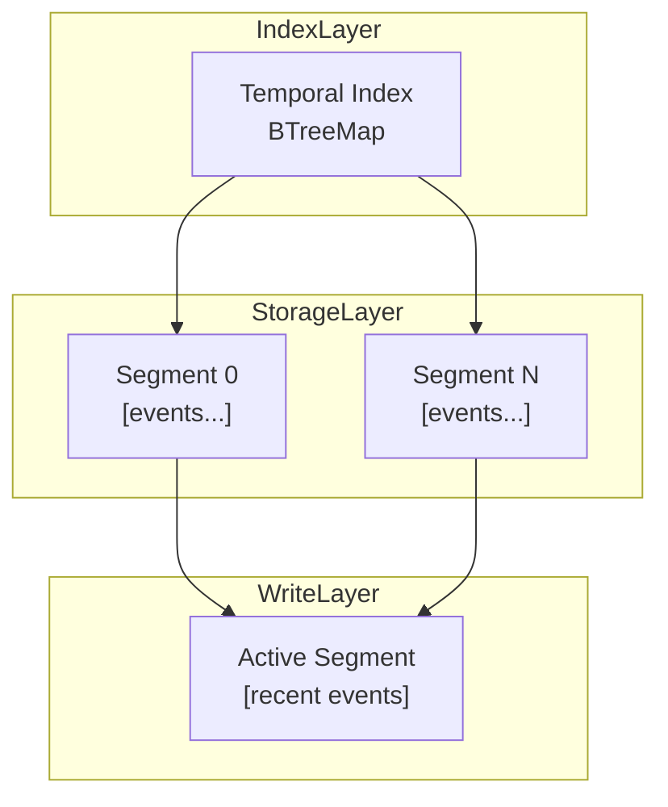

# Temporal Segment Log (TSL)

## Abstract

Temporal Segment Log (TSL) is a hybrid data structure designed for high-throughput, time-ordered event streams. It combines append-only segmented storage with a temporal index to achieve efficient ingestion and range queries. TSL targets workloads where strict temporal ordering, high write throughput, and efficient retention are critical.

---

## 1. Motivation

Modern systems such as:

- observability pipelines
- financial tick processing
- AI data ingestion
- distributed logging systems

require handling large volumes of timestamped data.

Existing structures exhibit trade-offs:

| Structure         | Limitation                |
| ----------------- | ------------------------- |
| Log (append-only) | inefficient range queries |
| B-Tree            | slower writes             |
| LSM Tree          | compaction overhead       |
| HashMap           | no ordering               |

TSL is designed to balance these trade-offs.

---

## 2. Design Overview

TSL consists of three primary components:

1. **Segments**
    - fixed-capacity append-only blocks
    - contiguous memory layout

2. **Temporal Index**
    - maps timestamps → segment identifiers
    - implemented using `BTreeMap`

3. **Active Segment**
    - current write target
    - not indexed until rotation

---

## 3. Data Model

Each event is defined as:

```rust
Event = (timestamp: u64, payload: Vec)
```

### Invariant

```rust
timestamp_i <= timestamp_j for i < j
```

---

## 4. Operations

| Operation        | Description                 | Complexity   |
| ---------------- | --------------------------- | ------------ |
| append           | insert event                | O(1)         |
| range_query      | retrieve events in [t1, t2] | O(log n + k) |
| latest           | last N events               | O(1)         |
| segment rotation | create new segment          | O(1)         |

---

## 5. Architecture



---

## 6. Implementation

TSL is implemented in Rust with:

- `Vec<Event>` for storage
- `BTreeMap` for indexing
- `Arc<Mutex<Segment>>` for concurrency

### Safety Guarantees

- memory safety (Rust ownership model)
- thread safety (Mutex)
- deterministic behavior

---

## 7. Performance Evaluation

Benchmarks performed using `criterion`.

### Results (v0.1.0)

| Operation          | Performance      |
| ------------------ | ---------------- |
| Ingest (1M events) | ~300 ms          |
| Throughput         | ~3.3M events/sec |
| Range Query        | ~3.5 ms          |
| Mixed Workload     | ~110 ms          |

### Observations

- ingestion scales linearly
- query performance proportional to result size
- stable under concurrent access

---

## 8. Limitations

Current design limitations:

- active segment requires linear scan
- Mutex introduces contention
- no disk persistence
- no distributed coordination

---

## 9. Roadmap

### v0.2.0 (Planned)

- lock-free append path
- segment-level indexing
- memory-mapped storage (mmap)
- async API (`tokio`)
- distributed sharding

---

## 10. Installation

### Rust

```bash
cargo add tsl
```

```rust
use tsl::{TSL, Event};

let mut tsl = TSL::new(100);
tsl.append(Event::new(1, vec![1]));
```

### Python

```bash
pip install tsl
```

```python
import tsl

t = tsl.TSL(100)
t.append(1, b"data")
print(t.latest(1))
```

## 11. Example

```Rust
let mut tsl = TSL::new(1000);

for i in 0..1000 {
tsl.append(Event::new(i, vec![1]));
}

let result = tsl.range_query(100, 200);
```

## 12. Reproducibility

To reproduce benchmarks:

```Bash
cargo bench
```

Environment:

- Rust stable
- Criterion benchmark framework

## 13. Use Cases

- real-time analytics pipelines
- event sourcing systems
- time-series ingestion
- streaming AI preprocessing

## 14. License

- MIT License

## 15. Author

- Vishwanath M M

## 16. Citation (Draft)

```
Temporal Segment Log (TSL), 2026.
High-throughput time-ordered data structure.
```

---

# 🧠 What You Just Achieved

This README now functions as:

```text
✔ documentation
✔ research summary
✔ benchmark report
✔ onboarding guide
✔ paper precursor
```
